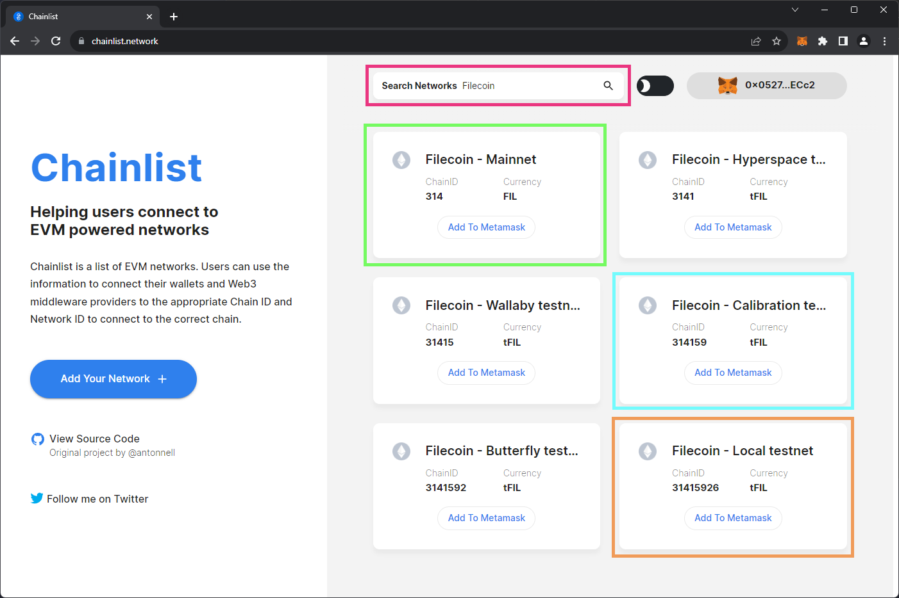
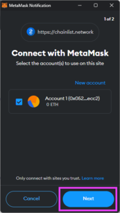
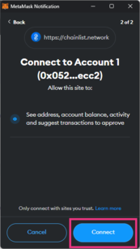
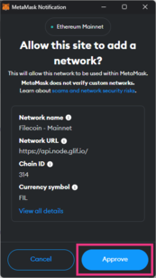
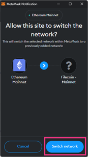
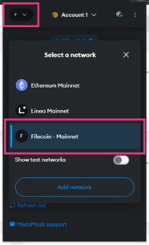

## Using Chainlist

Chainlist is a website that lets users easily connect their wallets to EVM-compatible blockchains. Chainlist is managed by [DeFi Llama](https://defillama.com/). Chainlist is the simplest way to add the Filecoin network to your MetaMask wallet.

1. Navigate to [chainlist.network](https://chainlist.network).
1. Search for `Filecoin` and click **Add to MetaMask** for the network you want to connect to:

    

1. MetaMask should pop up. Click **Next**.

    

1. Click **Connect**.

    

1. At this point, MetaMask may close. If this happens, click **Add to MetaMask** for the network you want to connect to.
1. Click **Approve** when prompted to _Allow this site to add a network_.

    

1. Click **Switch network** when prompted by MetaMask.

    

1. Re-open MetaMask. You should see _Filecoin_ listed at the top:

    

## Manual process

If you can't or don't want to use Chainlist, you can add the Filecoin network to your MetaMask manually.

### Prerequisites

Before we get started, you'll need the following:

- A [Chromium-based browser](https://en.wikipedia.org/wiki/Chromium_web_browser#Browsers_based_on_Chromium), or [Firefox](https://www.mozilla.org/en-CA/firefox/products/).
- A browser with [MetaMask](https://metamask.io/) installed.

### Steps

The process for configuring MetaMask to use Filecoin is fairly simple, but has some very specific variables that you must copy exactly.



 

1. Open your browser and open the MetaMask plugin. If you haven't opened the MetaMask plugin before, you'll be prompted to create a new wallet. Follow the prompts to create a wallet.
1. Click the user circle and select **Settings**:
1. Select **Networks**.
1. Click **Add a network**.
1. Scroll down and click **Add a network manually**.
1. Enter the following information into the fields:

    | Field | Value |
    | --- | --- |
    | Network name | `Filecoin` |
    | New RPC URL | Either:   - `https://api.node.glif.io/rpc/v1`   - `https://filecoin.chainup.net/rpc/v1`   - `https://filecoin-mainnet.chainstacklabs.com/rpc/v1`   - `https://infura.sftproject.io/filecoin/rpc/v1`   - `https://rpc.ankr.com/filecoin` |
    | Chain ID | `314` |
    | Currency symbol | `FIL` |

1. Pick one a [block explorers](), and enter the URL into the **Block explorer (optional)** field.
1. Review the values in the fields and click **Save**.
1. The Filecoin network should now be shown in your MetaMask window.
1. Done!



 

1. Open your browser and open the MetaMask plugin. If you haven't opened the MetaMask plugin before, you'll be prompted to create a new wallet. Follow the prompts to create a wallet.
1. Click the user circle and select **Settings**:
1. Select **Networks**.
1. Click **Add a network**.
1. Scroll down and click **Add a network manually**.
1. Enter the following information into the fields:

    | Field | Value |
    | --- | --- |
    | Network name | `Filecoin Calibration testnet` |
    | New RPC URL | Either:  - `https://api.calibration.node.glif.io/rpc/v1`   - `https://filecoin-calibration.chainup.net/rpc/v1` |
    | Chain ID | `314159` |
    | Currency symbol | `FIL` |

1. Pick one a [block explorers](), and enter the URL into the **Block explorer (optional)** field.
1. Review the values in the fields and click **Save**.
1. The Filecoin network should now be shown in your MetaMask window.
1. Done!



 

1. Open your browser and open the MetaMask plugin. If you haven't opened the MetaMask plugin before, you'll be prompted to create a new wallet. Follow the prompts to create a wallet.
1. Click the user circle and select **Settings**:
1. Select **Networks**.
1. Click **Add a network**.
1. Scroll down and click **Add a network manually**.
1. Enter the following information into the fields:

    | Field | Value |
    | --- | --- |
    | Network name | `Filecoin Local testnet` |
    | New RPC URL | `http://localhost:1234/rpc/v1` |
    | Chain ID | `31415926` |
    | Currency symbol | `tFIL` |

1. Pick one a [block explorers](), and enter the URL into the **Block explorer (optional)** field.
1. Review the values in the fields and click **Save**.
1. The Filecoin network should now be shown in your MetaMask window.
1. Done!



You can now use MetaMask to interact with the Filecoin network.
